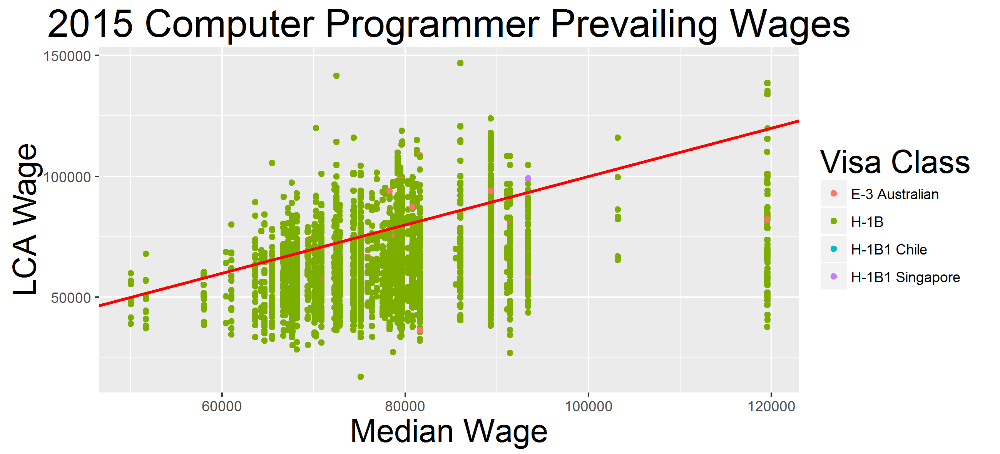
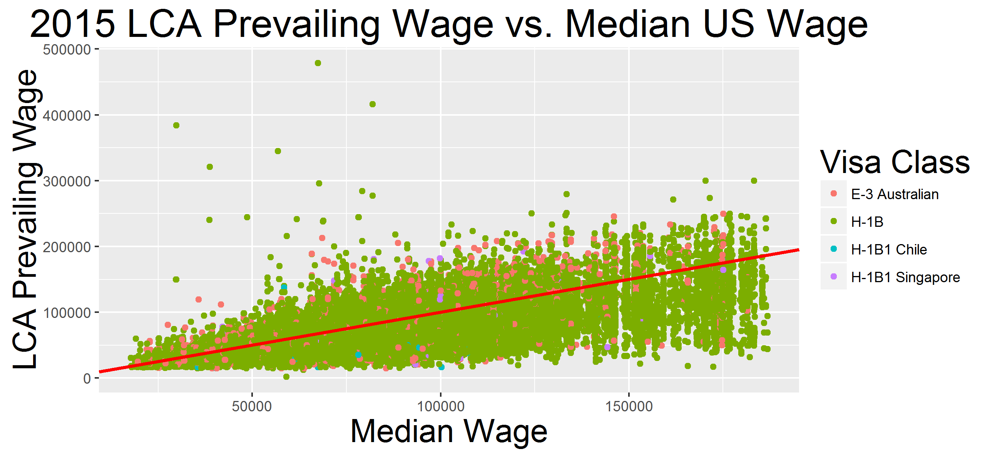
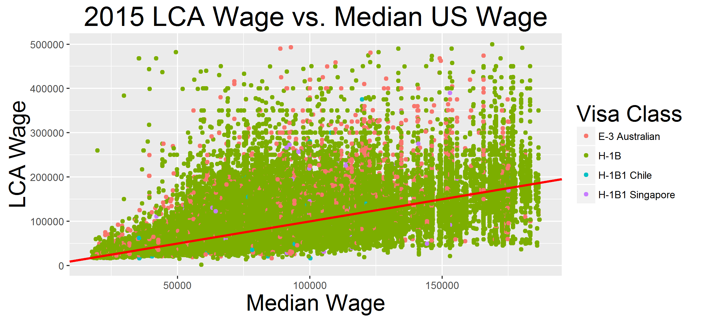
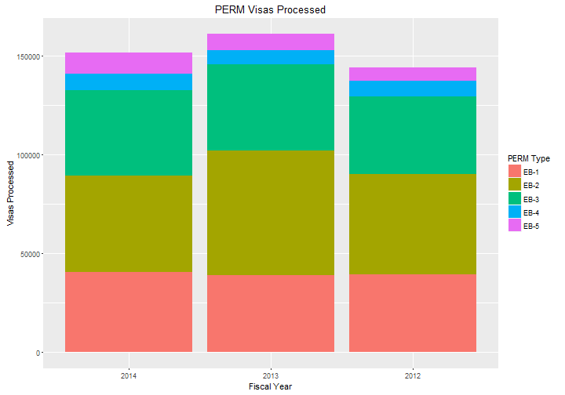
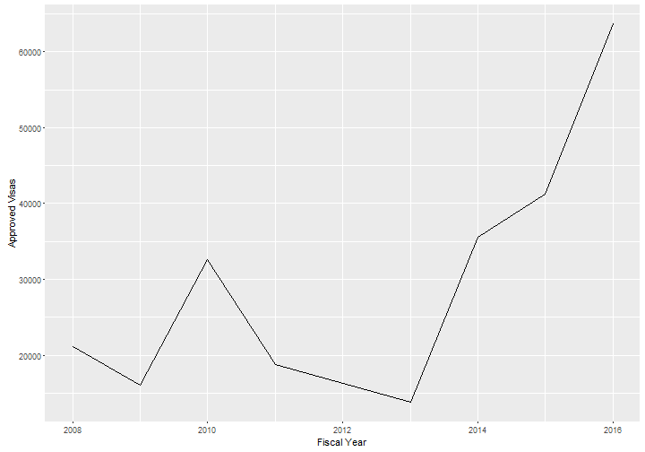
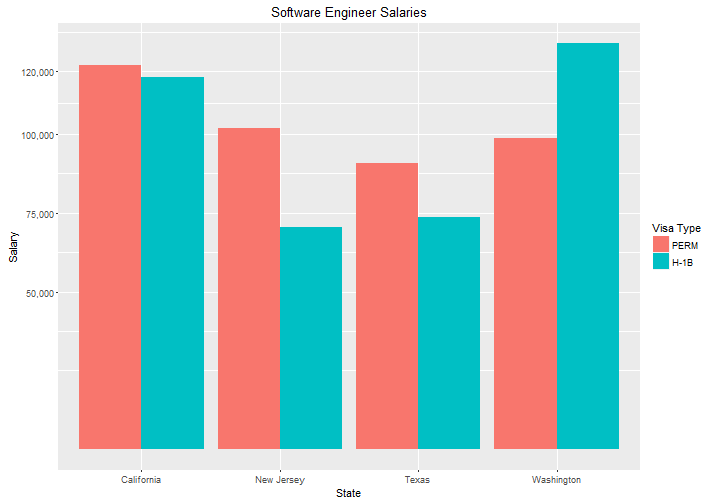
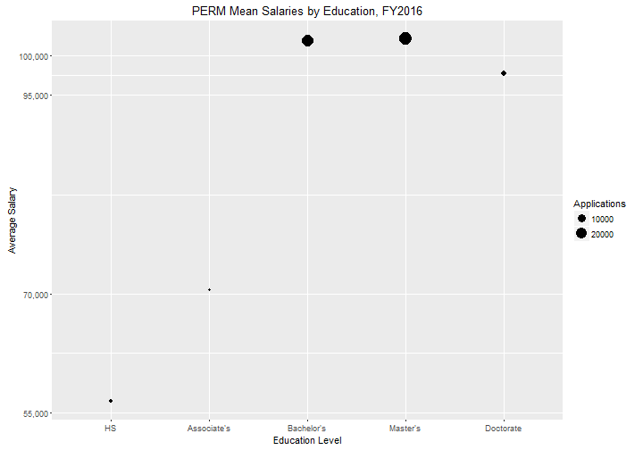
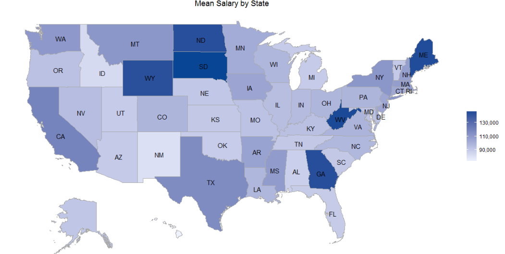
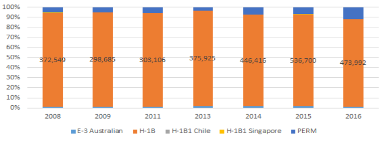
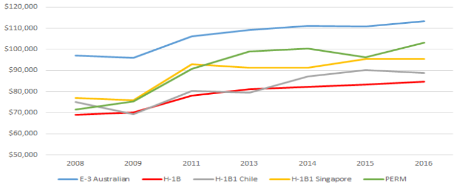

Analysis of Foreign Workers in the U.S.
========================================================
author: Arun Ranganathan / Brian Detweiler / Jacques Anthony
date: December 15th, 2016

Agenda
========================================================

 - H-1B
   - Center for Immigration Studies Report
 - PERM (Program Electronic Review Management)
   - Statistics
   - State-Level Salaries
   - Trends Over Time
  
H-1B Overview
========================================================

 - Demand > Supply
  - 172,500 H-1B Labor Condition Applications submitted in FY 2015
  - Only 85,000 total available

How to Work in the U.S.
========================================================
 - Job must qualify as speciality occupation 
   - >= Bachelor's degree 
   - Licenses or special trainings may be considered
 - First 20,000 H-1B awarded Master's degree+

***

Center for Immigration Studies Report, FY 2005
========================================================
 - Claims:
   - Businesses abusing H-1B for cheap labor
   - Computer Programmers
     - 84% of prevailing wage claims below the median
     - $16,000 below median on average
     
   
Our Findings, Computer Programmers FY 2015
========================================================
 - 88.92% of prevailing wage claims below the median
 - Average prevailing wage claim was $17,510 below median
   - On par with 21% inflation
 - Essentially no change since 2005

   

Our Findings, All Occupations FY 2015
========================================================
 - H-1B Prevailing Wages
   - 72.68% prevailing wage claims below median
   - Standard deviation of $23,159

Our Findings, All Occupations FY 2015
========================================================
 - H-1B Actual Wages
   - 39.24% prevailing wage claims below median
   - $5,861 below median on average
   - Standard deviation of $31,895

   
PERM Visas
========================================================
 - First step of Green Card process
 - Employer must be prepared to hire applicant 
   - Must prove there are not enough US citizens or permanent residents qualified for the position

PERM Statistics
========================================================
 - Number of Approved PERM visas increasing drastically
   - Doubled from 2010 to 2016
 - However, there was no considerable salary difference  within education levels

***

PERM Statistics
========================================================
 - PERM salaries 15% higher than H-1B on average (FY 2016)
 - Salaries vary widely from state to state
 - Salary gap tends to narrow with more prestigious job titles
 - QUIZ: Average UNO student vs. Harvard PERM salary?
 
***

PERM Statistics
========================================================

 - No considerable salary difference within education levels

***

PERM Statistics
========================================================

| Employer      | Applications  | Average Salary  |
| ------------- |:-------------:| ---------------:|
| Microsoft     | 15,089        | $103,650        |
| Cognizant     | 13,387        | $73,085         |
| Intel         | 6,212         | $90,279         |
| Google        | 5,101         | $121,872        |
| Amazon        | 3,406         | $98,049         |

State-Level Salaries
========================================================

Trends Over Time
========================================================

